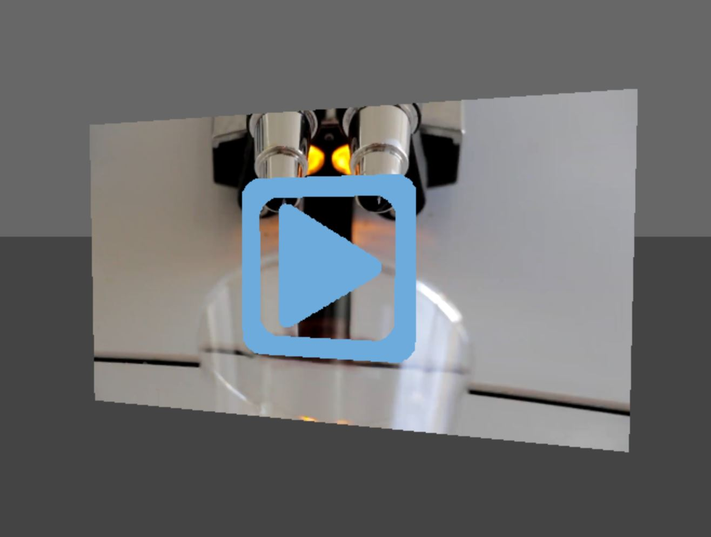

# THREE JS Video Player Object



## Introduction
Standard THREE JS video textures have their limitations. Although incredably versitile, the standard video texture object does not by default support source changes after initialization. Video sources must be fully loaded and ready to play before the texture can be rendered. This can cause issues when attempting to set video sources dynamically or when attempting to change sources. Our THREE JS video player object solves these issues and adds other functionality for easily playing an HTML5 video on a plane in a THREE JS scene.


---
## Video Player Object
Our `THREEVideoPlayer` object extends `THREE.Mesh` so as to act as any other object in a THREE scene. The mesh is built with a `THREE.PlaneBufferGeometry` and is styled with a `THREE.MeshBasicMaterial`. The object's height is 1; width is scaled to match source aspect ratio.


---
## Constructor 
### `THREEVideoPlayer(options) : THREEVideoPlayer`
Constructor may be called without any options and will be initialized with a null source and default values.
```
// Options Object:
{
    source: string,     // String specifing path to video source
                        // * note - video source must be served from same domain
    muted: boolean,     // Boolean specifying if video is muted
    autoplay: boolean,  // Boolean specifying if video is autoplay
                        // * note - video must be muted for autoplay
    loop: boolean,      // Boolean specifying if video will loop
    volume: float,      // Float between 0.0 and 1.0 specifying video volume
    play_btn_color: hex // Hex value representing play button color
}
```


---
## Methods
### `play() : void`
Play video.


### `pause() : void`
Pause video.


### `isPaused() : boolean`
Returns boolean value representing whether or not the video is paused. 


### `canPlay() : boolean`
Returns boolean value representing wether or not the video can play.


### `setSource(string source) : void`
Set the video player's source. Accepts a string specifying the path to the video source file.

> Note - the video source file must be served from the same domain. Videos loaded from external domains, even with CORS headers, will not work in 3D.


### `clearSource() : void`
Clear the video player's current source. Need not be called before calling `setSource()`.


### `setMuted(boolean isMuted) : void`
Set the video player's muted property. 


### `isMuted() : boolean`
Returns a boolean value representing whether or not the video player is muted.


### `setAutoPlay(boolean isAutoplay) : void`
Set the video player's autoplay property. Video must be muted for autoplay to work. 


### `isAutoplay() : boolean`
Returns a boolean value representing whether or not the video player will auto play.


### `setLoop(boolean isLoop) : void`
Set the video player's loop property.


### `isLoop() : boolean`
Returns a boolean value representing whether or not the video player will loop.


### `setVolume(float volume): void`
Set the video player's volume. Accepts a float value between `0.0` and `1.0`. 


### `getVolume() : float`
Returns a float value between `0.0` and `1.0` representing the video player's volume property.


---
## Usage
> This object's source file is a CommonJS module designed to work with NODE JS and WebPack (see the Demo section below for more information). As such, this usage guide is specificaly geared twords this build pipeline. Your specific implementation may vary depending on your build pipeline and changes to the source file may be needed if your build pipeline does not support CommonJS modules.


Import the video player object from its source file.
```
import { THREEVideoPlayer } from './source/three-video-player.js';
```


If you are using WebPack's file loader, import your source video file(s).
```
import CoffeeVideo from './coffee.mp4';
import OtherCoffeeVideo from './other-coffee.mp4';
```


After setting up your THREE JS scene, camera, and renderer, initialize the video player object with desired options and add it to your scene.
```
const videoPlayer = new THREEVideoPlayer({
    source: CoffeeVideo,
    play_btn_color: 0x6EABDD
});

scene.add(videoPlayer);
```


The video player's source can be changed with a call to the `setSource()` method.
```
videoPlayer.setSource(OtherCoffeeVideo);
```


The video player may also be interracted with like any other `THREE.Mesh` object.
```
videoPlayer.position.y = 0.5;
videoPlayer.position.z = 5.0;
```


Click events can be detected with a `THREE.Raycaster` to trigger plays/pauses.
```
render.domElement.addEventListener('mousedown', function(event){

    event.preventDefault();

    var mousePosition = new THREE.Vector2(
            (event.clientX/window.innerWidth)*2-1, 
            -(event.clientY/window.innerHeight)*2+1);

    var raycaster = new THREE.Raycaster();
    raycaster.setFromCamera(mousePosition, camera);

    var intersects = raycaster.intersectObject(videoPlayer, true);

    if(intersects.length > 0 && videoPlayer.canPlay()){
        if(videoPlayer.isPaused()){
            videoPlayer.play();
        } else {
            videoPlayer.pause();
        }
    }

});
```


---
## Demo
Source code for a demo of the `THREEVideoPlayer` object can be found in `demo.js`. This demo's build pipeline relies on NODE JS and WebPack. Dependencies and other NODE configuration options can be found in the demo's `package.json` file. The demo's WebPack configuration can be found in the `webpack.config.js` file.


To build the demo run the following NPM command in the demo's root directory.
```
$ npm run build
```
The demo will be compiled into the `docs` folder. This is done to support hosting on GitHub pages.  

> The coffee video for the demo was sourced from COVERR. https://coverr.co/videos/coffee-machine-in-action-2BCJxAabQ1
